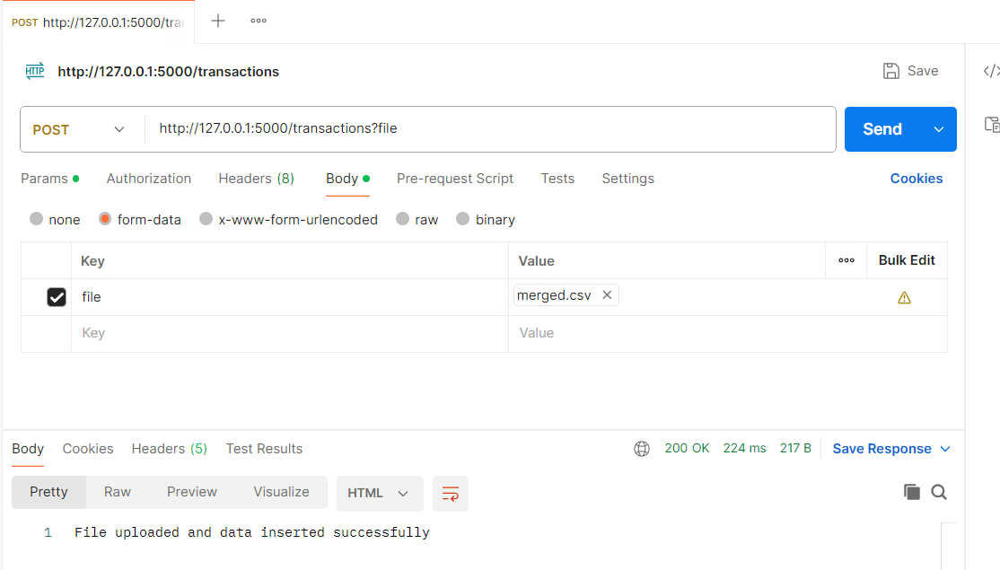
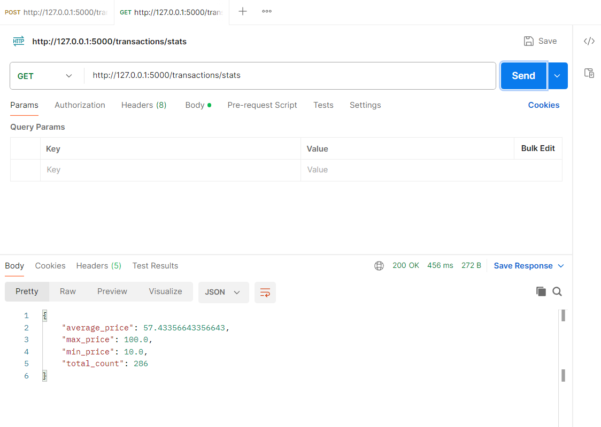

# Challenge Pragma - Prueba Ingeniero de Datos

El objetivo es construir un pipeline que procese archivos CSV de transacciones, los inserte en una base de datos MySQL y mantenga estadísticas agregadas de manera eficiente.

## Estructura del Proyecto

```
challenge/
│
├── main.py                # Punto de entrada, inicia el servidor Flask y ejecuta el pipeline de merge
├── transactions.py        # Endpoints Flask para carga de archivos y consulta de estadísticas
├── merge_files.py         # Función para fusionar archivos CSV de la carpeta uploads
├── database_connect.py    # Clase para conexión a MySQL usando SQLAlchemy
├── schema.sql             # Script SQL para crear las tablas necesarias
├── result/
│   └── merged.csv         # Archivo CSV generado por el pipeline de merge
└── uploads/
    └── *.csv              # Archivos CSV de entrada (transacciones a cargar)
```

## Requisitos

- Python 3.8+
- MySQL Server
- Paquetes Python: `flask`, `sqlalchemy`, `pandas`, `mysql-connector-python` o `pymysql`

Instala dependencias con:
```bash
pip install flask sqlalchemy pandas mysql-connector-python
```

## Configuración de la Base de Datos

1. Crea la base de datos y las tablas ejecutando el script `schema.sql` en MySQL:

```sql
CREATE DATABASE pragma;

CREATE TABLE pragma.transactions (
   `time` date DEFAULT NULL,
   `price` int DEFAULT NULL,
   `user_id` int DEFAULT NULL
);

CREATE TABLE IF NOT EXISTS pragma.transactions_stats (
    id INT PRIMARY KEY DEFAULT 1,
    total_count INT DEFAULT 0,
    total_sum DOUBLE DEFAULT 0,
    total_min DOUBLE DEFAULT NULL,
    total_max DOUBLE DEFAULT NULL
);

INSERT IGNORE INTO pragma.transactions_stats (id) VALUES (1);
```

2. Configura el usuario y contraseña en `database_connect.py` según tu entorno.

## Ejecución del Pipeline

1. Coloca los archivos CSV de entrada en la carpeta `uploads/` (al mismo nivel que `challenge/`).
2. Ejecuta el pipeline y el servidor Flask:

```bash
python main.py
```

Esto fusionará los archivos CSV en `result/merged.csv` y levantará el servidor Flask.

## Endpoints Disponibles

### 1. Cargar un archivo de transacciones

- **POST** `/transactions`
- **Body:** `form-data` con clave `file` (tipo File) y el archivo CSV a cargar.

Ejemplo en Postman:
- Método: POST
- URL: `http://127.0.0.1:5000/transactions`
- Body: form-data, key: `file`, value: selecciona tu archivo



### 2. Consultar estadísticas agregadas

- **GET** `/transactions/stats`
- Devuelve un JSON con el recuento total, suma, mínimo, máximo y promedio de `price`.

Ejemplo de respuesta:
```json
{
  "total_count": 139,
  "average_price": 57.9,
  "min_price": 10,
  "max_price": 100
}
```



## Lógica de Estadísticas Incrementales

- Cada vez que se inserta un archivo, se actualiza la tabla `transactions_stats` de forma incremental (sin recalcular sobre todos los datos).
- Esto permite mantener estadísticas agregadas eficientes y en tiempo real.

## Validación

Para validar el pipeline:
1. Sube archivos como `merged.csv` y `validation.csv` usando el endpoint `/transactions`.
2. Consulta `/transactions/stats` después de cada carga para ver cómo cambian las estadísticas.

